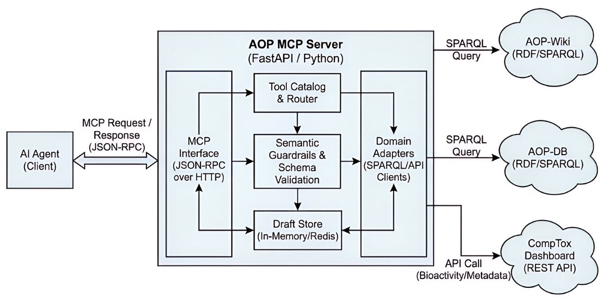

# AOP MCP Server

[](https://github.com/ToxMCP/aop-mcp/actions/workflows/ci.yml)
[](https://doi.org/10.64898/2026.02.06.703989)
[](./LICENSE)
[](https://github.com/ToxMCP/aop-mcp/releases)
[](https://www.python.org/)

> Part of **ToxMCP** Suite → https://github.com/ToxMCP/toxmcp


**Public MCP endpoint for Adverse Outcome Pathway (AOP) discovery, semantics, and draft authoring.**  
Expose AOP-Wiki, AOP-DB, CompTox, semantic tooling, and draft workflows to any MCP-aware agent (Codex CLI, Gemini CLI, Claude Code, etc.).

## Architecture



## What's new in v0.4.0

- Refined `assess_aop_confidence` so OECD core confidence dimensions are reported separately from supplemental AOP-level evidence text.
- Added explicit `oecd_alignment` and `supplemental_signals` output to make the confidence summary less misleading when KE essentiality is unavailable.
- Improved support-text parsing for KER biological plausibility and empirical support, producing more realistic calls on live AOP-Wiki content.
- Updated KE-facing tool inputs to advertise `key_event_id` while keeping legacy `ke_id` requests compatible.
- Extended `search_assays_for_key_event` with receptor/gene alias normalization for targets such as `PXR/NR1I2`, `FXR/NR1H4`, `LXR/NR1H3`, and `NRF2/NFE2L2`.
- Tightened KE term derivation so title and short-name evidence outrank noisier description-only terms, while filtering generic tokens such as `protein`, `serum`, and `accumulation`.
- Added applicability-aware assay reranking from KE taxonomic metadata, without allowing taxon matches to create false positives on their own.
- Hardened KE assay search with an AOP-Wiki measurement-method fallback when the live CompTox assay catalog is temporarily unavailable.

## Why this project exists

AOP research depends on stitching together heterogeneous sources (AOP-Wiki, AOP-DB, CompTox, AOPOntology, MediaWiki drafts) while enforcing ontology, provenance, and publication rules. Traditional pipelines are bespoke notebooks or scripts that agents cannot safely reuse.  

The AOP MCP server wraps those workflows in a **secure, programmable interface**:

- **Unified MCP surface** – discovery, semantics, authoring, and job utilities share a single tool catalog exposed over JSON-RPC.
- **Semantic guardrails** – applicability/evidence helpers normalize identifiers and validate responses against JSON Schema.
- **Draft-to-publish path** – create drafts, edit key events and KERs, attach stressors, and feed publish planners without leaving MCP.

> Already using the O-QT MCP server? This project mirrors that experience with domain adapters tuned for AOP evidence and authoring.

---

## Feature snapshot

| Capability | Description |
| --- | --- |
| 🧬 **AOP discovery adapters** | Schema-validated tooling for AOP-Wiki, AOP-DB, and CompTox federation with improved phenotype search ranking, synonym expansion, and curated AOP retrieval. |
| 🧪 **Assay curation workflows** | Reverse AOP-to-assay lookup, KE-centered CompTox assay search with alias normalization and taxonomic reranking, multi-AOP aggregation, and query-driven assay selection for phenotype-focused curation work. |
| 🧭 **Semantic services** | CURIE normalization, applicability helper, and evidence matrix builder; enforced via JSON Schema responses. |
| ✍️ **Draft authoring** | Create/update drafts, key events, relationships, and stressor links with provenance and diff support. |
| 📦 **Artifacts & audit** | Structured logging, audit bundles, metrics for SPARQL/cache, draft edits, and direct assay table export in `csv`/`tsv`. |
| ⚙️ **Configurable transports** | FastAPI JSON-RPC service with configurable endpoints, retries, and observability hooks. |
| 🤖 **Agent friendly** | Verified with Codex CLI, Gemini CLI, and Claude Code; includes quick-start snippets and smoke scripts. |

---

## Table of contents

1. [Quick start](#quick-start)
2. [Configuration](#configuration)
3. [Tool catalog](#tool-catalog)
4. [Running the server](#running-the-server)
5. [Integrating with coding agents](#integrating-with-coding-agents)
6. [Output artifacts](#output-artifacts)
7. [Security checklist](#security-checklist)
8. [Development notes](#development-notes)
9. [Contributing](#contributing)
10. [Security policy](#security-policy)
11. [Code of conduct](#code-of-conduct)
12. [Citation](#citation)
13. [Roadmap](#roadmap)
14. [License](#license)

---

## Quickstart TL;DR

```bash
# 1) install
python -m venv .venv
source .venv/bin/activate
pip install -e .[dev]

# 2) configure
cp .env.example .env

# 3) run
uvicorn src.server.api.server:app --reload --host 0.0.0.0 --port 8003

# 4) verify
curl -s http://localhost:8003/health | jq .
curl -s http://localhost:8003/mcp \
  -H "Content-Type: application/json" \
  -d '{"jsonrpc":"2.0","id":1,"method":"tools/list","params":{}}' | jq .
```

## Quick start

```bash
git clone https://github.com/senseibelbi/AOP_MCP.git
cd AOP_MCP
python -m venv .venv
source .venv/bin/activate
pip install -e .[dev]
cp .env.example .env
uvicorn src.server.api.server:app --reload --host 0.0.0.0 --port 8003
```

> **Heads-up:** Federated SPARQL queries benefit from internet access. When offline, enable fixture fallbacks in `.env` (see [Configuration](#configuration)).

Once the server is running:

- HTTP MCP endpoint: `http://localhost:8003/mcp`
- Health check: `http://localhost:8003/health`

## Verification (smoke test)

Once the server is running:

```bash
# health
curl -s http://localhost:8003/health | jq .

# list MCP tools
curl -s http://localhost:8003/mcp \
  -H "Content-Type: application/json" \
  -d '{"jsonrpc":"2.0","id":1,"method":"tools/list","params":{}}' | jq .
```


---

## Configuration

Settings are loaded through [`pydantic-settings`](https://docs.pydantic.dev/latest/concepts/settings/) with `.env`/`.env.local` support. Start from `.env.example` and keep `.env` untracked. Key environment variables:

| Variable | Required | Default | Description |
| --- | --- | --- | --- |
| `AOP_MCP_ENVIRONMENT` | Optional | `development` | Controls defaults like permissive CORS and logging detail. |
| `AOP_MCP_LOG_LEVEL` | Optional | `INFO` | Application log level. |
| `AOP_MCP_AOP_WIKI_SPARQL_ENDPOINTS` | Optional | `https://aopwiki.rdf.bigcat-bioinformatics.org/sparql` | Comma-separated list of AOP-Wiki SPARQL endpoints. |
| `AOP_MCP_AOP_DB_SPARQL_ENDPOINTS` | Optional | `https://aopwiki.rdf.bigcat-bioinformatics.org/sparql` | Comma-separated list of AOP-DB SPARQL endpoints (defaults to AOP-Wiki for fallback). |
| `AOP_MCP_COMPTOX_BASE_URL` | Optional | `https://comptox.epa.gov/dashboard/api/` | Base URL for CompTox enrichment calls. |
| `AOP_MCP_COMPTOX_BIOACTIVITY_URL` | Optional | `https://comptox.epa.gov/ctx-api/` | Base URL for CompTox Bioactivity API (required for assay mapping). |
| `AOP_MCP_COMPTOX_API_KEY` | Optional | – | API key for CompTox (required for assay mapping and higher quota). |
| `AOP_MCP_ENABLE_FIXTURE_FALLBACK` | Optional | `0` | Set to `1` to serve fixture data when remote SPARQL endpoints are unavailable. |

See `docs/contracts/endpoint-matrix.md` and `src/server/config/settings.py` for the extended configuration surface (auth, retries, cache sizing, job service knobs).

---

## Tool catalog

| Category | Highlight tools | Notes |
| --- | --- | --- |
| AOP discovery | `search_aops`, `get_aop`, `list_key_events`, `list_kers` | Federated AOP-Wiki queries with pagination, schema validation, and improved ranking for phenotype searches. |
| OECD review helpers | `get_key_event`, `get_ker`, `get_related_aops`, `assess_aop_confidence`, `find_paths_between_events` | Exposes richer KE/KER metadata, shared-AOP discovery, partial OECD-aligned heuristic confidence summaries, and directed path traversal for review and network analysis workflows. |
| Cross-mapping | `map_chemical_to_aops`, `map_assay_to_aops`, `list_assays_for_aop`, `search_assays_for_key_event` | Links AOP-Wiki and AOP-DB stressor data to CompTox identifiers and bioactivity assays, including KE-derived assay search with title-biased term extraction, alias normalization, taxonomic preference hints, and AOP-Wiki fallback extraction. |
| Assay aggregation | `list_assays_for_aops`, `list_assays_for_query`, `export_assays_table` | Deduplicates assay evidence across multiple AOPs and exports the ranked assay table as `csv` or `tsv`. |
| Semantic helpers | `get_applicability`, `get_evidence_matrix` | CURIE normalization plus evidence matrix builder for review packages. |
| Draft authoring | `create_draft_aop`, `add_or_update_ke`, `add_or_update_ker`, `link_stressor`, `validate_draft_oecd` | In-memory draft graph edits with provenance plus OECD-style completeness checks before review/publish. |

Every response is validated against JSON Schemas in `docs/contracts/schemas/`. Refer to `docs/contracts/tool-catalog.md` for full definitions and examples.

### Example assay curation flow

For a phenotype-driven workflow such as steatosis assay curation:

1. Call `search_aops` with a phenotype query such as `liver steatosis`.
2. Inspect the returned AOP set or pass the same query to `list_assays_for_query`.
3. Export the aggregated assay candidates with `export_assays_table` when you need a table for downstream review.

For a curated KE or MIE workflow:

1. Call `get_key_event` to inspect the event metadata and confirm the mechanistic scope.
2. Call `search_assays_for_key_event` to rank CompTox assays using KE-derived gene symbols, mechanism phrases, and KE taxonomic applicability when available. Use `key_event_id` in the MCP payload; legacy `ke_id` remains accepted for compatibility.
3. Review `derived_search_terms`, `matched_terms`, and `applicability_match` in the result to understand why an assay was surfaced.
4. Treat the result as a first-pass assay candidate list, not a curated KE-to-assay ontology mapping.

### Example OECD review flow

For an OECD-style read/review workflow:

1. Call `get_aop` or `search_aops` to select the pathway.
2. Use `get_key_event` and `get_ker` for detailed KE/KER inspection.
3. Use `assess_aop_confidence` to assemble a heuristic confidence summary from the available KE and KER evidence text.
4. Read `confidence_dimensions` as the OECD core dimensions, `supplemental_signals` as non-core context, and `oecd_alignment` for the current completeness status.

Example `tools/call` payloads:

```json
{
  "name": "list_assays_for_query",
  "arguments": {
    "query": "liver steatosis",
    "search_limit": 12,
    "aop_limit": 5,
    "limit": 25,
    "per_aop_limit": 15,
    "min_hitcall": 0.95
  }
}
```

```json
{
  "name": "export_assays_table",
  "arguments": {
    "query": "liver steatosis",
    "format": "csv",
    "search_limit": 12,
    "aop_limit": 5,
    "limit": 25,
    "per_aop_limit": 15,
    "min_hitcall": 0.95
  }
}
```

```json
{
  "name": "search_assays_for_key_event",
  "arguments": {
    "key_event_id": "KE:239",
    "limit": 10
  }
}
```

```json
{
  "name": "assess_aop_confidence",
  "arguments": {
    "aop_id": "AOP:232"
  }
}
```

---

## Running the server

The FastAPI app lives at `src/server/api/server.py`. All transports share the same JSON-RPC handlers defined in `src/server/mcp/router.py`.

```bash
uvicorn src.server.api.server:app --host 0.0.0.0 --port 8003
```

- `GET /health` – environment banner, dependency status.
- `POST /mcp` – JSON-RPC 2.0 endpoint exposing the MCP tool catalog.

Use `scripts/test_mcp_endpoints.sh` for a scripted smoke run against `/mcp` and to capture sample payloads.

---

## Integrating with coding agents

Add the server to your agent’s MCP configuration. Example Codex CLI entry:

```json
{
  "name": "aop-mcp",
  "endpoint": "http://localhost:8003/mcp"
}
```

Tested surfaces:

- **Codex CLI** – `codex mcp connect http://localhost:8003/mcp`
- **Gemini CLI** – add the endpoint under `mcp_servers` to auto-negotiate the tool catalog.
- **Claude Code** – configure a custom MCP server with the base URL above.

Because the server supports `initialize`, `tools/list`, `tools/call`, and `shutdown`, agents immediately gain discovery plus structured responses (`content` + `structuredContent`).

---

## Output artifacts

- **Structured MCP payloads** – JSON responses aligned with schemas under `docs/contracts/schemas/`.
- **Audit + provenance** – draft edits capture author, summary, and version metadata for downstream review queues.
- **Metrics & logs** – in-process metrics recorder (`src/instrumentation/metrics.py`) and structured logs (`src/instrumentation/logging.py`) for SPARQL/cache and job lifecycle events.
- **Fixture captures** – optional local fixtures for offline testing when `AOP_MCP_ENABLE_FIXTURE_FALLBACK=1`.

---

## Security checklist

- ✅ Structured logging + audit chain validation (`src/instrumentation/audit.py`).
- ✅ SPARQL + CompTox clients respect retry/backoff limits; tune via settings.
- ✅ MCP tools enforce JSON Schema validation before returning data to agents.
- 🔲 Optional auth middleware (see `docs/adr/architecture-drivers.md`) – integrate with your gateway before production exposure.
- 🔲 Review publish planners (MediaWiki / AOPOntology) before enabling automated publish jobs.

---

## Development notes

- `pytest` – run unit and schema validation tests.
- `scripts/test_mcp_endpoints.sh` – exercise the MCP catalog end-to-end.
- `make contract` – regenerate/validate JSON Schema docs (if available in your tooling setup).
- `python scripts/benchmarks.py` – baseline latency testing (extend with real workloads).
- `docs/opensourcing-checklist.md` – final checks before switching repository visibility to public.
- Keep docs in sync: update `docs/contracts/endpoint-matrix.md`, `docs/quickstarts/`, and schema files when payloads change.

---

## Contributing

See `CONTRIBUTING.md` for local setup, test workflow, and pull request expectations.

---

## Security policy

See `SECURITY.md` for reporting guidance and supported versions.

---

## Code of conduct

This project follows `CODE_OF_CONDUCT.md`.

---

## Citation

If you use `toxMCP` / AOP MCP Server in your work, please cite:

- **Ivo Djidrovski**. BioRxiv preprint (2026). DOI: [10.64898/2026.02.06.703989v1](https://www.biorxiv.org/content/10.64898/2026.02.06.703989v1)

---

## Roadmap

- Persistent draft store (Redis/Postgres) with multi-user access control.
- Automated benchmark thresholds feeding CI gating.
- Additional MCP resources/prompts for curated applicability templates and evidence summaries.
- Publish workflow hardening (approval queues, RBAC simulation, MediaWiki integration tests).

---

## License

Apache-2.0. See `LICENSE`.
## Acknowledgements / Origins

ToxMCP was developed in the context of the **VHP4Safety** project (see: https://github.com/VHP4Safety) and related research/engineering efforts.

Funding: Dutch Research Council (NWO) — NWA.1292.19.272 (NWA programme)

This suite integrates with third-party data sources and services (e.g., EPA CompTox, ADMETlab, AOP resources, OECD QSAR Toolbox, Open Systems Pharmacology). Those upstream resources are owned and governed by their respective providers; users are responsible for meeting any access, API key, rate limit, and license/EULA requirements described in each module.

## ✅ Citation

Djidrovski, I. **ToxMCP: Guardrailed, Auditable Agentic Workflows for Computational Toxicology via the Model Context Protocol.** bioRxiv (2026). https://doi.org/10.64898/2026.02.06.703989

```bibtex
@article{djidrovski2026toxmcp,
  title   = {ToxMCP: Guardrailed, Auditable Agentic Workflows for Computational Toxicology via the Model Context Protocol},
  author  = {Djidrovski, Ivo},
  journal = {bioRxiv},
  year    = {2026},
  doi     = {10.64898/2026.02.06.703989},
  url     = {https://doi.org/10.64898/2026.02.06.703989}
}
```

Citation metadata: [`CITATION.cff`](./CITATION.cff)
