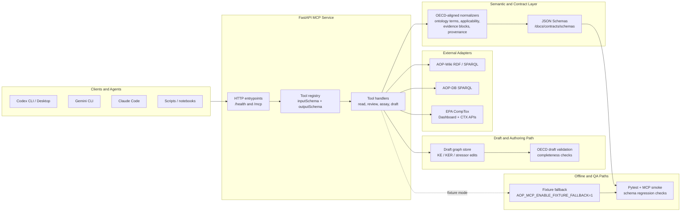

# AOP MCP Server

[](https://github.com/ToxMCP/aop-mcp/actions/workflows/ci.yml)
[](https://doi.org/10.64898/2026.02.06.703989)
[](./LICENSE)
[](https://github.com/ToxMCP/aop-mcp/releases)
[](https://www.python.org/)

> Part of **ToxMCP** Suite → https://github.com/ToxMCP/toxmcp


**Public MCP endpoint for Adverse Outcome Pathway (AOP) discovery, scientific review, and draft-to-publication workflows.**  
Expose AOP-Wiki, AOP-DB, CompTox, semantic tooling, quantitative review helpers, and draft review/export flows to any MCP-aware agent (Codex CLI, Gemini CLI, Claude Code, etc.).

## Architecture



The current implementation follows a layered model:

- `FastAPI + JSON-RPC` expose `/mcp` and `/health`, and keep transport concerns separate from domain logic.
- `Tool handlers` are the agent-facing API. They validate inputs, call adapters, and emit structured responses with JSON Schemas.
- `Semantic normalizers` reshape upstream RDF/API payloads into OECD-aligned objects such as `event_components`, `applicability`, `evidence_blocks`, and `provenance`.
- `Adapters` isolate AOP-Wiki, AOP-DB, and CompTox specifics so upstream changes do not leak into MCP contracts.
- `Draft tooling` remains separate from the read/review path, which keeps pathway evidence, assay discovery, and authoring concerns from collapsing into one surface.
- `Fixture fallback + smoke tests` let the server degrade cleanly in offline development and keep the public MCP contract regression-tested.

See `docs/architecture.md` for the fuller narrative and `docs/contracts/oecd-aligned-schema.md` for the OECD read-contract targets that now shape `get_aop`, `get_key_event`, `get_ker`, and `assess_aop_confidence`.
For task-oriented walkthroughs, see `docs/quickstarts/README.md`, especially `docs/quickstarts/oecd-draft-authoring.md` for the governed draft essentiality flow.

## What's new in v0.8.2

- **Hardened SPARQL query construction (AOP-01)** — replaced unsafe `template.format(**params)` interpolation with `TemplateCatalog.render_safe()`, which escapes string literals, validates URI schemes, and separates trusted structural fragments from user-facing parameters. Fixed a CAS-URI injection path in `map_chemical_to_aops`.
- **Added circuit-breaker resilience (AOP-02)** — per-endpoint circuit breaker with CLOSED/OPEN/HALF_OPEN states, exponential backoff + jitter between retries, and immediate surfacing of non-retryable 4xx errors.
- **Strengthened draft audit chain (AOP-03 / AOP-04)** — `VersionMetadata` now enforces `checksum` and `previous_checksum`, records `checksum_algorithm` (default `sha256-v1`), and supports `ElectronicSignature` records with `authored`/`reviewed`/`approved`/`rejected` semantics. `verify_audit_chain()` rejects unsupported algorithms, empty checksums, and broken chains.
- **Ontology drift protection scaffold (AOP-05)** — replaced hardcoded `_iri_to_curie()` logic with configurable `CurieResolver`, and added an `OntologyMigrator` framework with BFS pathfinding and term-mapping support.

## What's new in v0.8.1

- Expanded the scientific review surface beyond the original read path with specificity-aware assay ranking, HGNC-backed KE assay search, KER citation concordance, conservative taxonomic LCA inference, draft topology validation, directional concordance checks, and supplemental assay-cutoff ordering review.
- Added a coherent draft review workflow: `review_draft_bundle`, `review_draft_evidence_gaps`, `export_draft_review_artifact`, `save_draft_review_artifact`, `list_saved_draft_review_artifacts`, and `plan_linear_draft_review_document`.
- Added mechanistic discovery tooling for orphan stressor discovery across one AOP, multiple AOPs, and phenotype or mechanism queries, plus chemical trace overlays on draft graphs.
- Hardened live operations with a refreshed MCP smoke script, stronger CompTox caching and bounded concurrency, and real-server validation for KE assay search, orphan discovery, confidence review, and draft review/export flows.
- Added release-facing documentation for validated scientific examples in [docs/quickstarts/live-scientific-examples.md](/Volumes/Storage/topotox_space_relief_20260220/AOP_MCP/docs/quickstarts/live-scientific-examples.md).

## Previous highlights from v0.8.0

`v0.8.0` focused on draft-store hardening, broader schema/runtime contract coverage, improved assay-tool steering and diagnostics, and expanded regression coverage across the assay and draft integrity surfaces.

## Why this project exists

AOP research depends on stitching together heterogeneous sources (AOP-Wiki, AOP-DB, CompTox, AOPOntology, MediaWiki drafts) while enforcing ontology, provenance, and publication rules. Traditional pipelines are bespoke notebooks or scripts that agents cannot safely reuse.  

The AOP MCP server wraps those workflows in a **secure, programmable interface**:

- **Unified MCP surface** – discovery, semantics, scientific review, draft authoring, and handoff utilities share a single tool catalog exposed over JSON-RPC.
- **Semantic guardrails** – applicability/evidence helpers normalize identifiers and validate responses against JSON Schema.
- **Draft-to-publish path** – create drafts, edit key events and KERs, run topology/evidence review, export publication-style artifacts, and feed publish planners without leaving MCP.

> Already using the O-QT MCP server? This project mirrors that experience with domain adapters tuned for AOP evidence and authoring.

---

## Feature snapshot

| Capability | Description |
| --- | --- |
| 🧬 **AOP discovery adapters** | Schema-validated tooling for AOP-Wiki, AOP-DB, and CompTox federation with improved phenotype search ranking, synonym expansion, and curated AOP retrieval. |
| 🧪 **Assay and chemical discovery** | Reverse AOP-to-assay lookup, KE-centered CompTox assay search with HGNC-backed gene resolution, phrase-only assay fallback, specificity-aware ranking, multi-AOP aggregation, orphan stressor discovery, and query-driven assay or chemical triage. |
| 🧭 **Semantic services** | CURIE normalization, applicability helper, and evidence matrix builder; enforced via JSON Schema responses. |
| 🔬 **Scientific review** | OECD-oriented KE/KER review helpers, citation concordance, conservative taxonomic LCA inference, supplemental assay-cutoff ordering checks, and confidence review surfaces that combine narrative and assay-derived signals. |
| ✍️ **Draft review and authoring** | Create/update drafts, key events, relationships, and stressor links with provenance and diff support, plus topology validation, directional concordance review, evidence-gap analysis, quantitative KER review, and chemical trace overlays. |
| 📦 **Artifacts and handoff** | Export review bundles as JSON or Markdown, save indexed local review artifacts, build publication-style reports, review and attach Registry `aop_context` handoff bundles with preserved caveats/provenance, surface attached Registry support automatically inside normal draft review exports, produce Linear-ready document payloads, and export assay tables in `csv`/`tsv`. |
| ⚙️ **Configurable transports** | FastAPI JSON-RPC service with configurable endpoints, retries, and observability hooks. |
| 🤖 **Agent friendly** | Verified with Codex CLI, Gemini CLI, and Claude Code; includes quick-start snippets, live scientific examples, and an end-to-end MCP smoke script. |

---

## Table of contents

1. [Architecture](#architecture)
2. [Quick start](#quick-start)
3. [Configuration](#configuration)
4. [Tool catalog](#tool-catalog)
5. [Running the server](#running-the-server)
6. [Integrating with coding agents](#integrating-with-coding-agents)
7. [Output artifacts](#output-artifacts)
8. [Security checklist](#security-checklist)
9. [Current limitations](#current-limitations)
10. [Development notes](#development-notes)
11. [Contributing](#contributing)
12. [Security policy](#security-policy)
13. [Code of conduct](#code-of-conduct)
14. [Citation](#citation)
15. [Roadmap](#roadmap)
16. [License](#license)

---

## Quickstart TL;DR

```bash
# 1) install
python -m venv .venv
source .venv/bin/activate
pip install -e .[dev]

# 2) configure
cp .env.example .env

# 3) run
uvicorn src.server.api.server:app --reload --host 0.0.0.0 --port 8003

# 4) verify
curl -s http://localhost:8003/health | jq .
BASE_URL=http://localhost:8003 ./scripts/test_mcp_endpoints.sh
```

## Quick start

```bash
git clone https://github.com/ToxMCP/aop-mcp.git
cd aop-mcp
python -m venv .venv
source .venv/bin/activate
pip install -e .[dev]
cp .env.example .env
uvicorn src.server.api.server:app --reload --host 0.0.0.0 --port 8003
```

> **Heads-up:** Federated SPARQL queries benefit from internet access. When offline, enable fixture fallbacks in `.env` (see [Configuration](#configuration)).

Once the server is running:

- HTTP MCP endpoint: `http://localhost:8003/mcp`
- Health check: `http://localhost:8003/health`
- Task walkthroughs: `docs/quickstarts/find-aop.md`, `docs/quickstarts/live-scientific-examples.md`, `docs/quickstarts/oecd-draft-authoring.md`, and `docs/quickstarts/publish.md`

## Verification (smoke test)

Once the server is running, use the scripted smoke run first:

```bash
BASE_URL=http://localhost:8003 ./scripts/test_mcp_endpoints.sh
```

That smoke script validates the modern draft-review workflow end to end, including:

- `tools/list`
- draft creation and editing
- `review_draft_bundle`
- `export_draft_review_artifact`
- `save_draft_review_artifact`
- `list_saved_draft_review_artifacts`
- `plan_linear_draft_review_document`

If you only want a lightweight manual probe, the basic health and tool-list checks still work:

```bash
curl -s http://localhost:8003/health | jq .
curl -s http://localhost:8003/mcp \
  -H "Content-Type: application/json" \
  -d '{"jsonrpc":"2.0","id":1,"method":"tools/list","params":{}}' | jq .
```


---

## Configuration

Settings are loaded through [`pydantic-settings`](https://docs.pydantic.dev/latest/concepts/settings/) with `.env`/`.env.local` support. Start from `.env.example` and keep `.env` untracked. Key environment variables:

| Variable | Required | Default | Description |
| --- | --- | --- | --- |
| `AOP_MCP_ENVIRONMENT` | Optional | `development` | Controls defaults like permissive CORS and logging detail. |
| `AOP_MCP_LOG_LEVEL` | Optional | `INFO` | Application log level. |
| `AOP_MCP_AOP_WIKI_SPARQL_ENDPOINTS` | Optional | `https://aopwiki.rdf.bigcat-bioinformatics.org/sparql` | Comma-separated list of AOP-Wiki SPARQL endpoints. |
| `AOP_MCP_AOP_DB_SPARQL_ENDPOINTS` | Optional | `https://aopwiki.rdf.bigcat-bioinformatics.org/sparql` | Comma-separated list of AOP-DB SPARQL endpoints (defaults to AOP-Wiki for fallback). |
| `AOP_MCP_COMPTOX_BASE_URL` | Optional | `https://comptox.epa.gov/dashboard/api/` | Base URL for CompTox enrichment calls. |
| `AOP_MCP_COMPTOX_BIOACTIVITY_URL` | Optional | `https://comptox.epa.gov/ctx-api/` | Base URL for CompTox Bioactivity API (required for assay mapping). |
| `AOP_MCP_COMPTOX_API_KEY` | Optional | – | API key for CompTox (required for assay mapping and higher quota). |
| `AOP_MCP_ENABLE_FIXTURE_FALLBACK` | Optional | `0` | Set to `1` to serve fixture data when remote SPARQL endpoints are unavailable. |

See `docs/contracts/endpoint-matrix.md` and `src/server/config/settings.py` for the extended configuration surface (auth, retries, cache sizing, job service knobs).

---

## Tool catalog

| Category | Highlight tools | Notes |
| --- | --- | --- |
| AOP discovery | `search_aops`, `get_aop`, `list_key_events`, `list_kers` | Federated AOP-Wiki queries with pagination, schema validation, and improved ranking for phenotype searches. |
| OECD review helpers | `get_key_event`, `get_ker`, `get_related_aops`, `assess_aop_confidence`, `find_paths_between_events` | Exposes richer KE/KER metadata, shared-AOP discovery, partial OECD-aligned heuristic confidence summaries, supplemental KER citation-concordance signals, supplemental KER assay-cutoff ordering signals derived from linked stressors plus KE assay candidates, conservative taxonomic LCA inference for KER applicability, and directed path traversal for review and network analysis workflows. |
| Cross-mapping | `map_chemical_to_aops`, `map_assay_to_aops`, `list_assays_for_aop`, `get_assays_for_aop`, `search_assays_for_key_event` | Links AOP-Wiki and AOP-DB stressor data to CompTox identifiers and bioactivity assays. `search_assays_for_key_event` now merges structured HGNC-backed gene resolution with existing KE text heuristics when possible. `map_assay_to_aops` is assay -> AOP only; use the AOP-to-assay tools when you already have AOP IDs. |
| Assay aggregation | `list_assays_for_aops`, `get_assays_for_aops`, `list_assays_for_query`, `export_assays_table`, `discover_orphan_stressors_for_aop`, `discover_orphan_stressors_for_aops`, `discover_orphan_stressors_for_query` | Deduplicates assay evidence across multiple AOPs, surfaces diagnostics for empty assay lookups, exports the ranked assay table as `csv` or `tsv`, and can now surface orphan chemical candidates that are active in an AOP's strongest assays but are not already curated as linked stressors, for one pathway, across several pathways, or from a phenotype/mechanism query. Ranked assay outputs are discovery-oriented and specificity-aware, not curated ontology truth. |
| Semantic helpers | `get_applicability`, `get_evidence_matrix` | CURIE normalization plus evidence matrix builder for review packages. |
| Draft authoring | `create_draft_aop`, `add_or_update_ke`, `add_or_update_ker`, `link_stressor`, `attach_registry_handoff_to_draft`, `validate_draft_oecd`, `review_draft_assay_cutoff_ordering`, `review_draft_bundle`, `review_draft_evidence_gaps`, `review_registry_handoff_bundle`, `export_draft_review_artifact`, `save_draft_review_artifact`, `list_saved_draft_review_artifacts`, `plan_linear_draft_review_document`, `trace_chemical_on_draft` | In-memory draft graph edits with provenance plus OECD-style completeness checks, draft-graph topology checks, a unified draft review bundle that now carries structured evidence-gap findings and any attached Registry support, an action-oriented evidence-gap review surface, Registry handoff review/import planning for bounded AOP-support evidence, exportable review artifacts with both review and publication-style markdown profiles, a persistent local artifact-save path plus on-disk indexing for handoff files, a connector-ready Linear document handoff planner, a detailed draft KER assay-cutoff ordering review surface, and a chemical-trace overlay that projects one chemical's CompTox activity onto draft key events. |

Every response is validated against JSON Schemas in `docs/contracts/schemas/`. Refer to `docs/contracts/tool-catalog.md` for full definitions and examples.

### Validated live examples

The release now includes a concrete live-example guide at `docs/quickstarts/live-scientific-examples.md`.
The examples in that guide were validated against a running server on `2026-04-12` and cover:

- phenotype search around `liver steatosis`
- HGNC-backed KE assay search for `KE:239`
- orphan stressor discovery for `AOP:529`
- confidence review interpretation for `AOP:529`

### Which assay tool should I use?

| Goal | Tool | Input you should pass |
| --- | --- | --- |
| Start from an assay and find linked pathways | `map_assay_to_aops` | An assay identifier such as an AEID or assay name, not an AOP ID |
| Start from one or more AOPs and retrieve assay candidates | `get_assays_for_aop`, `get_assays_for_aops` | One AOP ID or a list of AOP IDs |
| Start from one AOP and look for uncurated mechanistic chemical candidates | `discover_orphan_stressors_for_aop` | One AOP ID plus optional assay and chemical scan limits |
| Start from several AOPs and look for recurring uncurated mechanistic chemical candidates | `discover_orphan_stressors_for_aops` | A list of AOP IDs plus optional per-AOP assay and chemical scan limits |
| Start from a phenotype or mechanism query | `list_assays_for_query` | A text query such as `liver steatosis` |
| Start from a phenotype or mechanism query and look for orphan chemicals | `discover_orphan_stressors_for_query` | A text query plus optional AOP selection and assay/chemical scan limits |
| Start from a key event or MIE | `search_assays_for_key_event` | A `key_event_id` such as `KE:239` |

### Example assay curation flow

For a phenotype-driven workflow such as steatosis assay curation:

1. Call `search_aops` with a phenotype query such as `liver steatosis`.
2. Inspect the returned AOP set or pass the same query to `list_assays_for_query`.
3. Export the aggregated assay candidates with `export_assays_table` when you need a table for downstream review.

For an explicit AOP-ID workflow such as “retrieve assay candidates for AOP:34 and AOP:232”:

1. Call `get_assays_for_aops` with the AOP ID list.
2. Inspect the top-level `diagnostics` object to see how many AOPs were processed and whether any returned no assays.
3. Inspect `diagnostics.per_aop` when `results` is empty or thinner than expected to distinguish missing CompTox access, no linked stressors, no CompTox chemical matches, and no bioactivity hits after filtering.

For an orphan-stressor discovery workflow such as “show me uncurated chemicals that light up the strongest assays behind AOP:529”:

1. Call `discover_orphan_stressors_for_aop` with the AOP ID and tune `assay_limit` or `per_assay_chemical_limit` if you want broader discovery.
2. Review `results[*].supporting_assays` to see which specificity-ranked AOP assays support each candidate chemical.
3. Treat the returned chemicals as mechanistic discovery leads. The tool excludes already curated AOP stressors conservatively by DTXSID, CAS RN, and normalized name when possible, but it does not establish causality or regulatory confidence on its own.

For a cross-pathway orphan-stressor workflow such as “show me uncurated chemicals that recur across the strongest assays behind AOP:529 and AOP:517”:

1. Call `discover_orphan_stressors_for_aops` with the AOP ID list.
2. Prioritize candidates with high `aop_support_count` and `supporting_assay_count`, because they recur across multiple pathway-specific assay sets rather than only one pathway.
3. Inspect `diagnostics.per_aop` when a pathway contributes no orphan candidates so you can distinguish missing CompTox access, empty assay layers, and complete exclusion by curated stressor matching.

For a query-driven orphan workflow such as “show me orphan candidates for liver steatosis”:

1. Call `discover_orphan_stressors_for_query` with the phenotype or mechanism query.
2. Inspect `selected_aops` to see which AOPs were chosen from the broader search result set before aggregation.
3. Use `diagnostics.warnings` and `diagnostics.per_aop` to see whether the result is thin because the query matched few useful AOPs, because some AOP hits lacked identifiers, or because the selected pathways had no surviving orphan candidates after curated-stressor exclusion.

For a curated KE or MIE workflow:

1. Call `get_key_event` to inspect the event metadata and confirm the mechanistic scope.
2. Call `search_assays_for_key_event` to rank CompTox assays using KE-derived gene symbols, mechanism phrases, and KE taxonomic applicability when available. Structured `gene_identifiers` are resolved through HGNC when possible, then merged with heuristic title and description parsing before CTX lookup. Phrase-only events search the full CTX assay metadata set with a narrow phenotype synonym layer before AOP-Wiki measurement methods. Use `key_event_id` in the MCP payload; legacy `ke_id` remains accepted for compatibility.
3. Review `derived_search_terms`, `matched_terms`, and `applicability_match` in the result to understand why an assay was surfaced.
4. Treat the result as a first-pass assay candidate list. Ranking is specificity-aware, but it is still a discovery aid rather than a curated KE-to-assay ontology mapping.

### Example OECD review flow

For an OECD-style read/review workflow:

1. Call `get_aop` or `search_aops` to select the pathway.
2. Use `get_key_event` and `get_ker` for detailed KE/KER inspection.
3. Use `assess_aop_confidence` to assemble a heuristic confidence summary from the available KE and KER evidence text.
4. Read `confidence_dimensions` as the OECD core dimensions, `supplemental_signals` as non-core context, and `oecd_alignment` for the current completeness status. `supplemental_signals.citation_concordance_signal` is a reference-overlap heuristic across linked KEs, not direct proof of empirical concordance. `supplemental_signals.assay_cutoff_ordering_signal` is a supplemental quantitative-ordering heuristic derived from linked stressor chemicals, KE assay candidates, and best observed CompTox activity cutoffs; it is not a curated qAOP model. `get_ker.citation_concordance` and `get_ker.assay_cutoff_ordering` expose the same style of local KER review context for one relationship at a time. `get_ker.applicability.taxa` may also use a lowest-common-ancestor taxon when upstream and downstream KE species differ but still share a conservative clade such as `Mammalia`.

### Example draft authoring flow

For an OECD-style draft workflow with explicit KE essentiality capture:

1. Call `create_draft_aop` to create the draft root.
2. Call `add_or_update_ke` for each KE and set `event_role` explicitly when you know whether the KE is the MIE, an intermediate event, or the AO. When you have an explicit essentiality judgment for a KE, store it under `attributes.essentiality`.
3. Call `add_or_update_ker` and `link_stressor` as the draft graph matures.
4. Call `review_draft_bundle` when you want the most complete draft review package in one response. It combines `validate_draft_oecd`, detailed draft assay-cutoff ordering review, structured evidence-gap findings, and optional chemical projection when you supply a chemical identifier.
5. Call `review_draft_evidence_gaps` when you want the same draft review signals reorganized into concrete missing-data items by root metadata, key event, relationship, and linked stressor.
6. Call `validate_draft_oecd` directly when you only need the compact readiness/result list. Explicit `essentiality.evidence_call` values of `not_assessed` or `not_reported` still count as coverage, as long as a rationale is present. The validator now also checks for draft-graph cycles, identifiable MIE and AO anchors, at least one directed MIE -> AO path, conservative directional concordance when the draft exposes enough polarity metadata, and supplemental KER assay-cutoff ordering when draft stressor links plus KE assay candidates expose enough CompTox evidence to compare upstream and downstream cutoffs.
7. Call `review_draft_assay_cutoff_ordering` when you only want the per-KER quantitative-ordering details behind the validator warnings. It surfaces derived draft stressors, per-KER assay-cutoff ordering calls, and supporting shared-chemical cutoff comparisons.
8. Call `trace_chemical_on_draft` when you want to see whether one chemical has CompTox assay activity that maps onto the drafted KE graph. Treat the result as a KE assay-overlay aid, not a causal proof engine.
9. Call `export_draft_review_artifact` when you want a scientist-facing Markdown artifact or a JSON export built from the unified draft review bundle for downstream review workflows. The Markdown profiles now also include evidence-gap sections, imported Registry-support sections when present, and next actions derived from `review_draft_evidence_gaps`, while the JSON export includes both a structured `evidence_gaps` block and any embedded imported-support summary alongside the bundle. Use `artifact_profile: "publication"` when you want a more structured report with explicit findings, evidence tables, and next actions.
10. Call `save_draft_review_artifact` when you want that exported artifact written to the local filesystem under `AOP_MCP_ARTIFACT_OUTPUT_DIR` (default `output/draft_reviews/`), with optional subdirectory and filename override support. The metadata sidecar now preserves both the bundle summary and the evidence-gap summary.
11. Call `list_saved_draft_review_artifacts` when you want to discover previously saved draft review files by draft ID, format, profile, or subdirectory without scanning the filesystem manually.
12. Call `plan_linear_draft_review_document` when you want a connector-ready Linear document payload built from either a live publication-profile export or one of the saved artifact files. Its response now preserves both the exported bundle summary and the evidence-gap summary.

To make directional concordance assessable, store KE polarity under fields such as `attributes.direction_of_change` when the title is not explicit enough, and store KER polarity under fields such as `attributes.relationship_effect` when the relationship is clearly activating versus inhibiting. To make draft assay-cutoff ordering assessable, link stressors with resolvable chemical metadata such as a recognizable label, CAS-like source value, or DTXSID-like source value.

Example `tools/call` payloads:

```json
{
  "name": "get_assays_for_aops",
  "arguments": {
    "aop_ids": ["AOP:34", "AOP:232", "AOP:591"],
    "limit": 25,
    "per_aop_limit": 15,
    "min_hitcall": 0.95
  }
}
```

```json
{
  "name": "list_assays_for_query",
  "arguments": {
    "query": "liver steatosis",
    "search_limit": 12,
    "aop_limit": 5,
    "limit": 25,
    "per_aop_limit": 15,
    "min_hitcall": 0.95
  }
}
```

```json
{
  "name": "export_assays_table",
  "arguments": {
    "query": "liver steatosis",
    "format": "csv",
    "search_limit": 12,
    "aop_limit": 5,
    "limit": 25,
    "per_aop_limit": 15,
    "min_hitcall": 0.95
  }
}
```

```json
{
  "name": "search_assays_for_key_event",
  "arguments": {
    "key_event_id": "KE:239",
    "limit": 10
  }
}
```

```json
{
  "name": "assess_aop_confidence",
  "arguments": {
    "aop_id": "AOP:232"
  }
}
```

```json
{
  "name": "create_draft_aop",
  "arguments": {
    "draft_id": "draft-steatosis-1",
    "title": "PXR activation leading to liver steatosis",
    "description": "Draft AOP assembled for OECD-style review.",
    "adverse_outcome": "Liver steatosis",
    "applicability": {
      "species": "human",
      "life_stage": "adult",
      "sex": "female"
    },
    "references": [
      {
        "title": "Example review reference"
      }
    ],
    "author": "researcher",
    "summary": "Create draft root"
  }
}
```

```json
{
  "name": "add_or_update_ke",
  "arguments": {
    "draft_id": "draft-steatosis-1",
    "version_id": "v2",
    "author": "researcher",
    "summary": "Add KE with governed essentiality",
    "identifier": "KE:239",
    "title": "Activation, Pregnane-X receptor, NR1I2",
    "attributes": {
      "measurement_methods": [
        "Reporter assay"
      ],
      "taxonomic_applicability": [
        "NCBITaxon:9606"
      ],
      "essentiality": {
        "evidence_call": "moderate",
        "rationale": "Blocking or attenuating this event reduced the downstream steatosis signal in the supporting studies curated for the draft.",
        "references": [
          {
            "identifier": "PMID:123456",
            "source": "pmid",
            "label": "Example essentiality reference"
          }
        ]
      }
    }
  }
}
```

```json
{
  "name": "add_or_update_ke",
  "arguments": {
    "draft_id": "draft-steatosis-1",
    "version_id": "v3",
    "author": "researcher",
    "summary": "Add KE with explicit no-data essentiality status",
    "identifier": "KE:459",
    "title": "Liver steatosis",
    "attributes": {
      "measurement": "Histopathology",
      "essentiality": {
        "evidence_call": "not_assessed",
        "rationale": "Direct perturbation evidence has not yet been curated for this KE in the current draft.",
        "references": []
      }
    }
  }
}
```

```json
{
  "name": "validate_draft_oecd",
  "arguments": {
    "draft_id": "draft-steatosis-1"
  }
}
```

---

## Current limitations

- `assess_aop_confidence` is OECD-aligned, not OECD-complete. Key-event essentiality is only inferred when bounded text evidence and supporting path structure both exist; path structure alone is retained as context but does not produce an essentiality score. The current RDF export still does not expose a dedicated structured essentiality field. Draft authoring now supports an explicit governed KE-level `essentiality` object, and `validate_draft_oecd` checks its coverage and shape.
- The governed draft `essentiality` object currently improves authoring and `validate_draft_oecd`, but it is not yet fed back into the live read-side `assess_aop_confidence` output or a downstream publish/export path.
- Quantitative understanding is sparse in many live AOP-Wiki records, so confidence outputs often remain partial even when the tool is behaving correctly.
- Applicability evidence calls are now structured on the read path, but they are still heuristic. They reflect source presence, cross-KE consistency, and supporting references rather than an explicit OECD applicability-strength field from upstream RDF.
- `search_assays_for_key_event` is a discovery helper, not a curated KE-to-assay ontology mapping or a full assay fit-for-purpose evaluator.
- Query-driven assay workflows depend on upstream AOP-DB stressor links and CompTox coverage. Relevant AOPs without mapped stressors or bioactivity data can legitimately return no assay candidates.
- Phrase-only KE assay search now includes a small curated phenotype synonym layer, but that vocabulary is intentionally narrow. When the phenotype or endpoint wording is not present upstream and not covered by the curated expansions, the tool can still return no hits even though the full CTX dataset was searched.
- Phenotype boundaries such as steatosis vs steatohepatitis / MASH still require manual scientific curation; the MCP should be used as a baseline discovery and prioritization layer rather than a final arbiter.
- Federated SPARQL and assay aggregation calls can be slow on live infrastructure, especially for broad phenotype queries and large AOPs.

---

## Running the server

The FastAPI app lives at `src/server/api/server.py`. All transports share the same JSON-RPC handlers defined in `src/server/mcp/router.py`.

```bash
uvicorn src.server.api.server:app --host 0.0.0.0 --port 8003
```

- `GET /health` – environment banner, dependency status.
- `POST /mcp` – JSON-RPC 2.0 endpoint exposing the MCP tool catalog.

Use `scripts/test_mcp_endpoints.sh` for a scripted smoke run against `/mcp`. It now validates the modern draft-review workflow end to end, including artifact export/save/list and Linear handoff planning.

---

## Integrating with coding agents

Add the server to your agent’s MCP configuration. Example Codex CLI entry:

```json
{
  "name": "aop-mcp",
  "endpoint": "http://localhost:8003/mcp"
}
```

Tested surfaces:

- **Codex CLI** – `codex mcp connect http://localhost:8003/mcp`
- **Gemini CLI** – add the endpoint under `mcp_servers` to auto-negotiate the tool catalog.
- **Claude Code** – configure a custom MCP server with the base URL above.

Because the server supports `initialize`, `tools/list`, `tools/call`, and `shutdown`, agents immediately gain discovery plus structured responses (`content` + `structuredContent`).

---

## Output artifacts

- **Structured MCP payloads** – JSON responses aligned with schemas under `docs/contracts/schemas/`.
- **Saved draft review files** – `save_draft_review_artifact` can persist review/profile exports under `AOP_MCP_ARTIFACT_OUTPUT_DIR` (default `output/draft_reviews/`) for downstream handoff.
- **Artifact inventory** – `list_saved_draft_review_artifacts` can index those saved files, using metadata sidecars when available and filesystem inference for older artifacts.
- **Connector-ready review handoff** – `plan_linear_draft_review_document` can turn a live or saved review artifact into a Linear document payload for downstream review systems.
- **Audit + provenance** – draft edits capture author, summary, and version metadata for downstream review queues.
- **Metrics & logs** – in-process metrics recorder (`src/instrumentation/metrics.py`) and structured logs (`src/instrumentation/logging.py`) for SPARQL/cache and job lifecycle events.
- **Fixture captures** – optional local fixtures for offline testing when `AOP_MCP_ENABLE_FIXTURE_FALLBACK=1`.

---

## Security checklist

- ✅ Structured logging + audit chain validation (`src/instrumentation/audit.py`).
- ✅ SPARQL + CompTox clients respect retry/backoff limits; tune via settings.
- ✅ MCP tools enforce JSON Schema validation before returning data to agents.
- 🔲 Optional auth middleware (see `docs/adr/architecture-drivers.md`) – integrate with your gateway before production exposure.
- 🔲 Review publish planners (MediaWiki / AOPOntology) before enabling automated publish jobs.

---

## Development notes

- `pytest` – run unit and schema validation tests.
- `scripts/test_mcp_endpoints.sh` – exercise the MCP catalog end-to-end.
- `make contract` – regenerate/validate JSON Schema docs (if available in your tooling setup).
- `python scripts/benchmarks.py` – baseline latency testing (extend with real workloads).
- `docs/opensourcing-checklist.md` – final checks before switching repository visibility to public.
- `docs/contracts/oecd-aligned-schema.md` – OECD-aligned target payload model and current coverage audit for `AOP`, `KE`, `KER`, and assessment outputs.
- Keep docs in sync: update `docs/contracts/endpoint-matrix.md`, `docs/quickstarts/`, and schema files when payloads change.

---

## Contributing

See `CONTRIBUTING.md` for local setup, test workflow, and pull request expectations.

---

## Security policy

See `SECURITY.md` for reporting guidance and supported versions.

---

## Code of conduct

This project follows `CODE_OF_CONDUCT.md`.

---

## Citation

If you use `toxMCP` / AOP MCP Server in your work, please cite:

- **Ivo Djidrovski**. BioRxiv preprint (2026). DOI: [10.64898/2026.02.06.703989v1](https://www.biorxiv.org/content/10.64898/2026.02.06.703989v1)

---

## Roadmap

- Persistent draft store (Redis/Postgres) with multi-user access control.
- Automated benchmark thresholds feeding CI gating.
- Additional MCP resources/prompts for curated applicability templates and evidence summaries.
- Publish workflow hardening (approval queues, RBAC simulation, MediaWiki integration tests).

---

## License

Apache-2.0. See `LICENSE`.
## Acknowledgements / Origins

ToxMCP was developed in the context of the **VHP4Safety** project (see: https://github.com/VHP4Safety) and related research/engineering efforts.

Funding: Dutch Research Council (NWO) — NWA.1292.19.272 (NWA programme)

This suite integrates with third-party data sources and services (e.g., EPA CompTox, ADMETlab, AOP resources, OECD QSAR Toolbox, Open Systems Pharmacology). Those upstream resources are owned and governed by their respective providers; users are responsible for meeting any access, API key, rate limit, and license/EULA requirements described in each module.

## ✅ Citation

Djidrovski, I. **ToxMCP: Guardrailed, Auditable Agentic Workflows for Computational Toxicology via the Model Context Protocol.** bioRxiv (2026). https://doi.org/10.64898/2026.02.06.703989

```bibtex
@article{djidrovski2026toxmcp,
  title   = {ToxMCP: Guardrailed, Auditable Agentic Workflows for Computational Toxicology via the Model Context Protocol},
  author  = {Djidrovski, Ivo},
  journal = {bioRxiv},
  year    = {2026},
  doi     = {10.64898/2026.02.06.703989},
  url     = {https://doi.org/10.64898/2026.02.06.703989}
}
```

Citation metadata: [`CITATION.cff`](./CITATION.cff)
