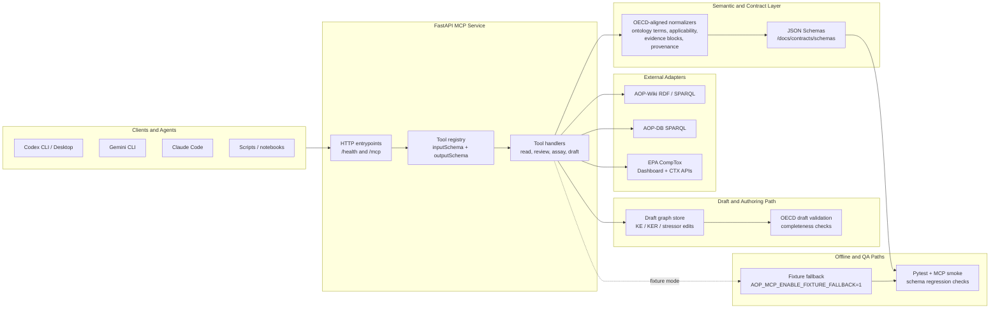

# AOP MCP Server

[](https://github.com/ToxMCP/aop-mcp/actions/workflows/ci.yml)
[](https://doi.org/10.64898/2026.02.06.703989)
[](./LICENSE)
[](https://github.com/ToxMCP/aop-mcp/releases)
[](https://www.python.org/)

> Part of **ToxMCP** Suite → https://github.com/ToxMCP/toxmcp


**Public MCP endpoint for Adverse Outcome Pathway (AOP) discovery, semantics, and draft authoring.**  
Expose AOP-Wiki, AOP-DB, CompTox, semantic tooling, and draft workflows to any MCP-aware agent (Codex CLI, Gemini CLI, Claude Code, etc.).

## Architecture



The current implementation follows a layered model:

- `FastAPI + JSON-RPC` expose `/mcp` and `/health`, and keep transport concerns separate from domain logic.
- `Tool handlers` are the agent-facing API. They validate inputs, call adapters, and emit structured responses with JSON Schemas.
- `Semantic normalizers` reshape upstream RDF/API payloads into OECD-aligned objects such as `event_components`, `applicability`, `evidence_blocks`, and `provenance`.
- `Adapters` isolate AOP-Wiki, AOP-DB, and CompTox specifics so upstream changes do not leak into MCP contracts.
- `Draft tooling` remains separate from the read/review path, which keeps pathway evidence, assay discovery, and authoring concerns from collapsing into one surface.
- `Fixture fallback + smoke tests` let the server degrade cleanly in offline development and keep the public MCP contract regression-tested.

See `docs/architecture.md` for the fuller narrative and `docs/contracts/oecd-aligned-schema.md` for the OECD read-contract targets that now shape `get_aop`, `get_key_event`, `get_ker`, and `assess_aop_confidence`.
For task-oriented walkthroughs, see `docs/quickstarts/README.md`, especially `docs/quickstarts/oecd-draft-authoring.md` for the governed draft essentiality flow.

## What's new in v0.7.0

- Added a governed KE-level `attributes.essentiality` contract on the draft write path, with controlled `evidence_call` values, required rationale text, and optional references/provenance.
- Extended `validate_draft_oecd` with `ke_essentiality_shape` and `ke_essentiality_coverage`, so explicit `not_assessed` and `not_reported` KE judgments are tracked as valid draft coverage instead of being silently omitted.
- Updated MCP schema discoverability so `tools/list` now exposes the nested `essentiality` input model for `add_or_update_ke`, and invalid payloads fail cleanly with `400` / `-32602` at the JSON-RPC boundary.
- Added `docs/quickstarts/oecd-draft-authoring.md` plus README links and examples for OECD-style draft authoring with governed KE essentiality capture.
- Expanded test coverage across write tools, OECD draft validation, and MCP smoke paths; the full suite now passes with `130 passed, 1 skipped`.

## Why this project exists

AOP research depends on stitching together heterogeneous sources (AOP-Wiki, AOP-DB, CompTox, AOPOntology, MediaWiki drafts) while enforcing ontology, provenance, and publication rules. Traditional pipelines are bespoke notebooks or scripts that agents cannot safely reuse.  

The AOP MCP server wraps those workflows in a **secure, programmable interface**:

- **Unified MCP surface** – discovery, semantics, authoring, and job utilities share a single tool catalog exposed over JSON-RPC.
- **Semantic guardrails** – applicability/evidence helpers normalize identifiers and validate responses against JSON Schema.
- **Draft-to-publish path** – create drafts, edit key events and KERs, attach stressors, and feed publish planners without leaving MCP.

> Already using the O-QT MCP server? This project mirrors that experience with domain adapters tuned for AOP evidence and authoring.

---

## Feature snapshot

| Capability | Description |
| --- | --- |
| 🧬 **AOP discovery adapters** | Schema-validated tooling for AOP-Wiki, AOP-DB, and CompTox federation with improved phenotype search ranking, synonym expansion, and curated AOP retrieval. |
| 🧪 **Assay curation workflows** | Reverse AOP-to-assay lookup, KE-centered CompTox assay search with direct CTX gene lookup, phrase-only full-assay fallback, narrow phenotype synonym expansion, alias normalization, and taxonomic reranking, plus multi-AOP aggregation and query-driven assay selection. |
| 🧭 **Semantic services** | CURIE normalization, applicability helper, and evidence matrix builder; enforced via JSON Schema responses. |
| ✍️ **Draft authoring** | Create/update drafts, key events, relationships, and stressor links with provenance and diff support, plus governed KE-level `essentiality` capture for OECD-style draft review. |
| 📦 **Artifacts & audit** | Structured logging, audit bundles, metrics for SPARQL/cache, draft edits, and direct assay table export in `csv`/`tsv`. |
| ⚙️ **Configurable transports** | FastAPI JSON-RPC service with configurable endpoints, retries, and observability hooks. |
| 🤖 **Agent friendly** | Verified with Codex CLI, Gemini CLI, and Claude Code; includes quick-start snippets and smoke scripts. |

---

## Table of contents

1. [Architecture](#architecture)
2. [Quick start](#quick-start)
3. [Configuration](#configuration)
4. [Tool catalog](#tool-catalog)
5. [Running the server](#running-the-server)
6. [Integrating with coding agents](#integrating-with-coding-agents)
7. [Output artifacts](#output-artifacts)
8. [Security checklist](#security-checklist)
9. [Current limitations](#current-limitations)
10. [Development notes](#development-notes)
11. [Contributing](#contributing)
12. [Security policy](#security-policy)
13. [Code of conduct](#code-of-conduct)
14. [Citation](#citation)
15. [Roadmap](#roadmap)
16. [License](#license)

---

## Quickstart TL;DR

```bash
# 1) install
python -m venv .venv
source .venv/bin/activate
pip install -e .[dev]

# 2) configure
cp .env.example .env

# 3) run
uvicorn src.server.api.server:app --reload --host 0.0.0.0 --port 8003

# 4) verify
curl -s http://localhost:8003/health | jq .
curl -s http://localhost:8003/mcp \
  -H "Content-Type: application/json" \
  -d '{"jsonrpc":"2.0","id":1,"method":"tools/list","params":{}}' | jq .
```

## Quick start

```bash
git clone https://github.com/ToxMCP/aop-mcp.git
cd aop-mcp
python -m venv .venv
source .venv/bin/activate
pip install -e .[dev]
cp .env.example .env
uvicorn src.server.api.server:app --reload --host 0.0.0.0 --port 8003
```

> **Heads-up:** Federated SPARQL queries benefit from internet access. When offline, enable fixture fallbacks in `.env` (see [Configuration](#configuration)).

Once the server is running:

- HTTP MCP endpoint: `http://localhost:8003/mcp`
- Health check: `http://localhost:8003/health`
- Task walkthroughs: `docs/quickstarts/find-aop.md`, `docs/quickstarts/oecd-draft-authoring.md`, and `docs/quickstarts/publish.md`

## Verification (smoke test)

Once the server is running:

```bash
# health
curl -s http://localhost:8003/health | jq .

# list MCP tools
curl -s http://localhost:8003/mcp \
  -H "Content-Type: application/json" \
  -d '{"jsonrpc":"2.0","id":1,"method":"tools/list","params":{}}' | jq .
```


---

## Configuration

Settings are loaded through [`pydantic-settings`](https://docs.pydantic.dev/latest/concepts/settings/) with `.env`/`.env.local` support. Start from `.env.example` and keep `.env` untracked. Key environment variables:

| Variable | Required | Default | Description |
| --- | --- | --- | --- |
| `AOP_MCP_ENVIRONMENT` | Optional | `development` | Controls defaults like permissive CORS and logging detail. |
| `AOP_MCP_LOG_LEVEL` | Optional | `INFO` | Application log level. |
| `AOP_MCP_AOP_WIKI_SPARQL_ENDPOINTS` | Optional | `https://aopwiki.rdf.bigcat-bioinformatics.org/sparql` | Comma-separated list of AOP-Wiki SPARQL endpoints. |
| `AOP_MCP_AOP_DB_SPARQL_ENDPOINTS` | Optional | `https://aopwiki.rdf.bigcat-bioinformatics.org/sparql` | Comma-separated list of AOP-DB SPARQL endpoints (defaults to AOP-Wiki for fallback). |
| `AOP_MCP_COMPTOX_BASE_URL` | Optional | `https://comptox.epa.gov/dashboard/api/` | Base URL for CompTox enrichment calls. |
| `AOP_MCP_COMPTOX_BIOACTIVITY_URL` | Optional | `https://comptox.epa.gov/ctx-api/` | Base URL for CompTox Bioactivity API (required for assay mapping). |
| `AOP_MCP_COMPTOX_API_KEY` | Optional | – | API key for CompTox (required for assay mapping and higher quota). |
| `AOP_MCP_ENABLE_FIXTURE_FALLBACK` | Optional | `0` | Set to `1` to serve fixture data when remote SPARQL endpoints are unavailable. |

See `docs/contracts/endpoint-matrix.md` and `src/server/config/settings.py` for the extended configuration surface (auth, retries, cache sizing, job service knobs).

---

## Tool catalog

| Category | Highlight tools | Notes |
| --- | --- | --- |
| AOP discovery | `search_aops`, `get_aop`, `list_key_events`, `list_kers` | Federated AOP-Wiki queries with pagination, schema validation, and improved ranking for phenotype searches. |
| OECD review helpers | `get_key_event`, `get_ker`, `get_related_aops`, `assess_aop_confidence`, `find_paths_between_events` | Exposes richer KE/KER metadata, shared-AOP discovery, partial OECD-aligned heuristic confidence summaries, and directed path traversal for review and network analysis workflows. |
| Cross-mapping | `map_chemical_to_aops`, `map_assay_to_aops`, `list_assays_for_aop`, `search_assays_for_key_event` | Links AOP-Wiki and AOP-DB stressor data to CompTox identifiers and bioactivity assays, including KE-derived assay search with direct CTX gene lookup, full-assay phrase search, narrow phenotype synonym expansion, title-biased term extraction, alias normalization, taxonomic preference hints, and AOP-Wiki fallback extraction. |
| Assay aggregation | `list_assays_for_aops`, `list_assays_for_query`, `export_assays_table` | Deduplicates assay evidence across multiple AOPs and exports the ranked assay table as `csv` or `tsv`. |
| Semantic helpers | `get_applicability`, `get_evidence_matrix` | CURIE normalization plus evidence matrix builder for review packages. |
| Draft authoring | `create_draft_aop`, `add_or_update_ke`, `add_or_update_ker`, `link_stressor`, `validate_draft_oecd` | In-memory draft graph edits with provenance plus OECD-style completeness checks, including governed KE-level `essentiality` coverage before review/publish. |

Every response is validated against JSON Schemas in `docs/contracts/schemas/`. Refer to `docs/contracts/tool-catalog.md` for full definitions and examples.

### Example assay curation flow

For a phenotype-driven workflow such as steatosis assay curation:

1. Call `search_aops` with a phenotype query such as `liver steatosis`.
2. Inspect the returned AOP set or pass the same query to `list_assays_for_query`.
3. Export the aggregated assay candidates with `export_assays_table` when you need a table for downstream review.

For a curated KE or MIE workflow:

1. Call `get_key_event` to inspect the event metadata and confirm the mechanistic scope.
2. Call `search_assays_for_key_event` to rank CompTox assays using KE-derived gene symbols, mechanism phrases, and KE taxonomic applicability when available. Gene-backed events use direct CTX gene assay endpoints first; phrase-only events search the full CTX assay metadata set with a narrow phenotype synonym layer before AOP-Wiki measurement methods. Use `key_event_id` in the MCP payload; legacy `ke_id` remains accepted for compatibility.
3. Review `derived_search_terms`, `matched_terms`, and `applicability_match` in the result to understand why an assay was surfaced.
4. Treat the result as a first-pass assay candidate list, not a curated KE-to-assay ontology mapping.

### Example OECD review flow

For an OECD-style read/review workflow:

1. Call `get_aop` or `search_aops` to select the pathway.
2. Use `get_key_event` and `get_ker` for detailed KE/KER inspection.
3. Use `assess_aop_confidence` to assemble a heuristic confidence summary from the available KE and KER evidence text.
4. Read `confidence_dimensions` as the OECD core dimensions, `supplemental_signals` as non-core context, and `oecd_alignment` for the current completeness status.

### Example draft authoring flow

For an OECD-style draft workflow with explicit KE essentiality capture:

1. Call `create_draft_aop` to create the draft root.
2. Call `add_or_update_ke` for each KE. When you have an explicit essentiality judgment for a KE, store it under `attributes.essentiality`.
3. Call `add_or_update_ker` and `link_stressor` as the draft graph matures.
4. Call `validate_draft_oecd` before review. Explicit `essentiality.evidence_call` values of `not_assessed` or `not_reported` still count as coverage, as long as a rationale is present.

Example `tools/call` payloads:

```json
{
  "name": "list_assays_for_query",
  "arguments": {
    "query": "liver steatosis",
    "search_limit": 12,
    "aop_limit": 5,
    "limit": 25,
    "per_aop_limit": 15,
    "min_hitcall": 0.95
  }
}
```

```json
{
  "name": "export_assays_table",
  "arguments": {
    "query": "liver steatosis",
    "format": "csv",
    "search_limit": 12,
    "aop_limit": 5,
    "limit": 25,
    "per_aop_limit": 15,
    "min_hitcall": 0.95
  }
}
```

```json
{
  "name": "search_assays_for_key_event",
  "arguments": {
    "key_event_id": "KE:239",
    "limit": 10
  }
}
```

```json
{
  "name": "assess_aop_confidence",
  "arguments": {
    "aop_id": "AOP:232"
  }
}
```

```json
{
  "name": "create_draft_aop",
  "arguments": {
    "draft_id": "draft-steatosis-1",
    "title": "PXR activation leading to liver steatosis",
    "description": "Draft AOP assembled for OECD-style review.",
    "adverse_outcome": "Liver steatosis",
    "applicability": {
      "species": "human",
      "life_stage": "adult",
      "sex": "female"
    },
    "references": [
      {
        "title": "Example review reference"
      }
    ],
    "author": "researcher",
    "summary": "Create draft root"
  }
}
```

```json
{
  "name": "add_or_update_ke",
  "arguments": {
    "draft_id": "draft-steatosis-1",
    "version_id": "v2",
    "author": "researcher",
    "summary": "Add KE with governed essentiality",
    "identifier": "KE:239",
    "title": "Activation, Pregnane-X receptor, NR1I2",
    "attributes": {
      "measurement_methods": [
        "Reporter assay"
      ],
      "taxonomic_applicability": [
        "NCBITaxon:9606"
      ],
      "essentiality": {
        "evidence_call": "moderate",
        "rationale": "Blocking or attenuating this event reduced the downstream steatosis signal in the supporting studies curated for the draft.",
        "references": [
          {
            "identifier": "PMID:123456",
            "source": "pmid",
            "label": "Example essentiality reference"
          }
        ]
      }
    }
  }
}
```

```json
{
  "name": "add_or_update_ke",
  "arguments": {
    "draft_id": "draft-steatosis-1",
    "version_id": "v3",
    "author": "researcher",
    "summary": "Add KE with explicit no-data essentiality status",
    "identifier": "KE:459",
    "title": "Liver steatosis",
    "attributes": {
      "measurement": "Histopathology",
      "essentiality": {
        "evidence_call": "not_assessed",
        "rationale": "Direct perturbation evidence has not yet been curated for this KE in the current draft.",
        "references": []
      }
    }
  }
}
```

```json
{
  "name": "validate_draft_oecd",
  "arguments": {
    "draft_id": "draft-steatosis-1"
  }
}
```

---

## Current limitations

- `assess_aop_confidence` is OECD-aligned, not OECD-complete. Key-event essentiality is only inferred when bounded text evidence and supporting path structure both exist; path structure alone is retained as context but does not produce an essentiality score. The current RDF export still does not expose a dedicated structured essentiality field. Draft authoring now supports an explicit governed KE-level `essentiality` object, and `validate_draft_oecd` checks its coverage and shape.
- The governed draft `essentiality` object currently improves authoring and `validate_draft_oecd`, but it is not yet fed back into the live read-side `assess_aop_confidence` output or a downstream publish/export path.
- Quantitative understanding is sparse in many live AOP-Wiki records, so confidence outputs often remain partial even when the tool is behaving correctly.
- Applicability evidence calls are now structured on the read path, but they are still heuristic. They reflect source presence, cross-KE consistency, and supporting references rather than an explicit OECD applicability-strength field from upstream RDF.
- `search_assays_for_key_event` is a discovery helper, not a curated KE-to-assay ontology mapping or a full assay fit-for-purpose evaluator.
- Query-driven assay workflows depend on upstream AOP-DB stressor links and CompTox coverage. Relevant AOPs without mapped stressors or bioactivity data can legitimately return no assay candidates.
- Phrase-only KE assay search now includes a small curated phenotype synonym layer, but that vocabulary is intentionally narrow. When the phenotype or endpoint wording is not present upstream and not covered by the curated expansions, the tool can still return no hits even though the full CTX dataset was searched.
- Phenotype boundaries such as steatosis vs steatohepatitis / MASH still require manual scientific curation; the MCP should be used as a baseline discovery and prioritization layer rather than a final arbiter.
- Federated SPARQL and assay aggregation calls can be slow on live infrastructure, especially for broad phenotype queries and large AOPs.

---

## Running the server

The FastAPI app lives at `src/server/api/server.py`. All transports share the same JSON-RPC handlers defined in `src/server/mcp/router.py`.

```bash
uvicorn src.server.api.server:app --host 0.0.0.0 --port 8003
```

- `GET /health` – environment banner, dependency status.
- `POST /mcp` – JSON-RPC 2.0 endpoint exposing the MCP tool catalog.

Use `scripts/test_mcp_endpoints.sh` for a scripted smoke run against `/mcp` and to capture sample payloads.

---

## Integrating with coding agents

Add the server to your agent’s MCP configuration. Example Codex CLI entry:

```json
{
  "name": "aop-mcp",
  "endpoint": "http://localhost:8003/mcp"
}
```

Tested surfaces:

- **Codex CLI** – `codex mcp connect http://localhost:8003/mcp`
- **Gemini CLI** – add the endpoint under `mcp_servers` to auto-negotiate the tool catalog.
- **Claude Code** – configure a custom MCP server with the base URL above.

Because the server supports `initialize`, `tools/list`, `tools/call`, and `shutdown`, agents immediately gain discovery plus structured responses (`content` + `structuredContent`).

---

## Output artifacts

- **Structured MCP payloads** – JSON responses aligned with schemas under `docs/contracts/schemas/`.
- **Audit + provenance** – draft edits capture author, summary, and version metadata for downstream review queues.
- **Metrics & logs** – in-process metrics recorder (`src/instrumentation/metrics.py`) and structured logs (`src/instrumentation/logging.py`) for SPARQL/cache and job lifecycle events.
- **Fixture captures** – optional local fixtures for offline testing when `AOP_MCP_ENABLE_FIXTURE_FALLBACK=1`.

---

## Security checklist

- ✅ Structured logging + audit chain validation (`src/instrumentation/audit.py`).
- ✅ SPARQL + CompTox clients respect retry/backoff limits; tune via settings.
- ✅ MCP tools enforce JSON Schema validation before returning data to agents.
- 🔲 Optional auth middleware (see `docs/adr/architecture-drivers.md`) – integrate with your gateway before production exposure.
- 🔲 Review publish planners (MediaWiki / AOPOntology) before enabling automated publish jobs.

---

## Development notes

- `pytest` – run unit and schema validation tests.
- `scripts/test_mcp_endpoints.sh` – exercise the MCP catalog end-to-end.
- `make contract` – regenerate/validate JSON Schema docs (if available in your tooling setup).
- `python scripts/benchmarks.py` – baseline latency testing (extend with real workloads).
- `docs/opensourcing-checklist.md` – final checks before switching repository visibility to public.
- `docs/contracts/oecd-aligned-schema.md` – OECD-aligned target payload model and current coverage audit for `AOP`, `KE`, `KER`, and assessment outputs.
- Keep docs in sync: update `docs/contracts/endpoint-matrix.md`, `docs/quickstarts/`, and schema files when payloads change.

---

## Contributing

See `CONTRIBUTING.md` for local setup, test workflow, and pull request expectations.

---

## Security policy

See `SECURITY.md` for reporting guidance and supported versions.

---

## Code of conduct

This project follows `CODE_OF_CONDUCT.md`.

---

## Citation

If you use `toxMCP` / AOP MCP Server in your work, please cite:

- **Ivo Djidrovski**. BioRxiv preprint (2026). DOI: [10.64898/2026.02.06.703989v1](https://www.biorxiv.org/content/10.64898/2026.02.06.703989v1)

---

## Roadmap

- Persistent draft store (Redis/Postgres) with multi-user access control.
- Automated benchmark thresholds feeding CI gating.
- Additional MCP resources/prompts for curated applicability templates and evidence summaries.
- Publish workflow hardening (approval queues, RBAC simulation, MediaWiki integration tests).

---

## License

Apache-2.0. See `LICENSE`.
## Acknowledgements / Origins

ToxMCP was developed in the context of the **VHP4Safety** project (see: https://github.com/VHP4Safety) and related research/engineering efforts.

Funding: Dutch Research Council (NWO) — NWA.1292.19.272 (NWA programme)

This suite integrates with third-party data sources and services (e.g., EPA CompTox, ADMETlab, AOP resources, OECD QSAR Toolbox, Open Systems Pharmacology). Those upstream resources are owned and governed by their respective providers; users are responsible for meeting any access, API key, rate limit, and license/EULA requirements described in each module.

## ✅ Citation

Djidrovski, I. **ToxMCP: Guardrailed, Auditable Agentic Workflows for Computational Toxicology via the Model Context Protocol.** bioRxiv (2026). https://doi.org/10.64898/2026.02.06.703989

```bibtex
@article{djidrovski2026toxmcp,
  title   = {ToxMCP: Guardrailed, Auditable Agentic Workflows for Computational Toxicology via the Model Context Protocol},
  author  = {Djidrovski, Ivo},
  journal = {bioRxiv},
  year    = {2026},
  doi     = {10.64898/2026.02.06.703989},
  url     = {https://doi.org/10.64898/2026.02.06.703989}
}
```

Citation metadata: [`CITATION.cff`](./CITATION.cff)
