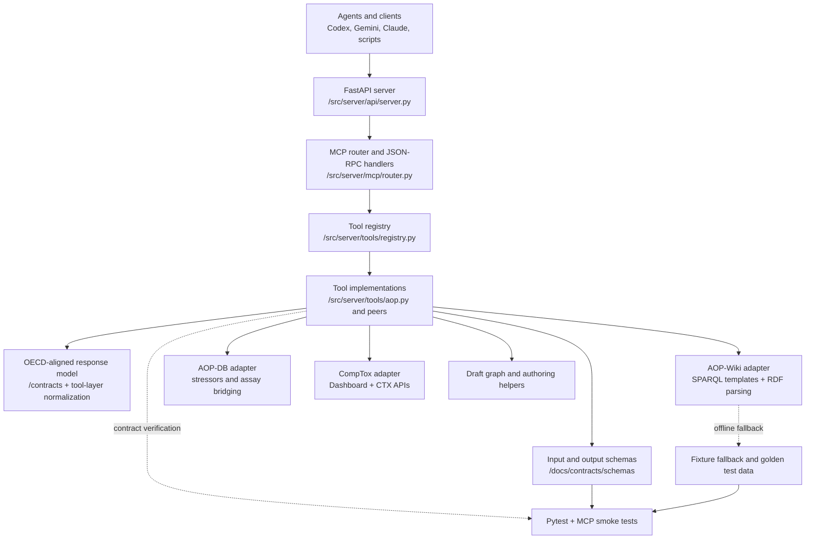
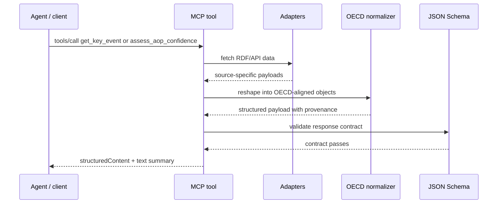
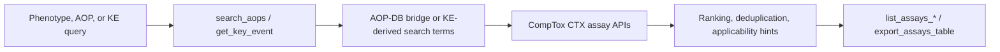

# Architecture

This document describes the current AOP MCP architecture as implemented, not just the original design direction.

The goal is to make three boundaries explicit:

- what is transport and MCP protocol surface;
- what is domain normalization into OECD-aligned payloads;
- what is upstream integration logic for AOP-Wiki, AOP-DB, and CompTox.

## System overview

## Layer responsibilities

### 1. Transport and protocol

Files:

- `src/server/api/server.py`
- `src/server/mcp/router.py`

Responsibilities:

- expose `/health` and `/mcp`
- handle JSON-RPC request and response framing
- keep HTTP concerns away from domain code

This layer should stay thin. It should not know how AOP-Wiki queries work or how OECD confidence is assembled.

### 2. Tool layer

Files:

- `src/server/tools/registry.py`
- `src/server/tools/aop.py`

Responsibilities:

- publish the MCP tool catalog
- define tool descriptions and `outputSchema`
- orchestrate calls across adapters
- return agent-friendly structured payloads

This is the public contract surface that coding agents actually consume.

### 3. OECD-aligned normalization layer

Key docs:

- `docs/contracts/oecd-aligned-schema.md`
- `docs/contracts/schemas/read/get_aop.response.schema.json`
- `docs/contracts/schemas/read/get_key_event.response.schema.json`
- `docs/contracts/schemas/read/get_ker.response.schema.json`
- `docs/contracts/schemas/read/assess_aop_confidence.response.schema.json`

Responsibilities:

- normalize upstream data into stable machine-readable objects
- keep OECD core evidence dimensions separate from supplemental signals
- expose provenance for normalized or derived fields
- keep pathway evidence, assay discovery, and draft authoring logically separate

Current examples:

- `get_key_event` now emits `event_components`, `biological_context`, `applicability`, `measurement_methods`, `references`, and `provenance`
- `get_ker` now emits `evidence_blocks` and structured upstream/downstream links
- `assess_aop_confidence` now separates OECD core dimensions from non-core context and reports explicit `oecd_alignment`

### 4. Adapter layer

Files:

- `src/adapters/aop_wiki.py`
- `src/adapters/aop_db.py`
- `src/adapters/comp_tox.py`

Responsibilities:

- isolate SPARQL and API details
- handle retries, failover, and source-specific parsing
- keep source data access independent from MCP response shape

Current adapter roles:

- `AOP-Wiki`: AOP, KE, KER, related-AOP, path, and evidence retrieval from RDF/SPARQL
- `AOP-DB`: stressor lookup and AOP-to-assay bridge support
- `CompTox`: assay and bioactivity lookup, direct CTX gene queries, phrase-only assay fallback

## Read and review flow

The important point is that adapter output is not the final MCP payload. The tool layer normalizes and validates before anything is returned to the client.

## Assay curation flow

There are two distinct assay paths:

- `AOP -> assay`: uses AOP-DB stressor chemicals plus CompTox bioactivity
- `KE -> assay`: uses KE-derived gene symbols and mechanism phrases, then queries CTX assay endpoints directly or falls back to phrase search

Those paths share output concepts but should not be confused. One is stressor-driven and the other is KE-term-driven.

## Offline and QA model

The repo uses two complementary safety nets:

- fixture fallback for local/offline development with `AOP_MCP_ENABLE_FIXTURE_FALLBACK=1`
- schema-aware regression tests for the MCP contract

This matters because live SPARQL and CompTox availability is variable. The contract should remain stable even when the upstream environment is not.

## Current architectural strengths

- clear adapter boundaries
- explicit MCP `outputSchema` on the richer read tools
- OECD-aligned read contract now documented and partially implemented
- clean separation between read/review flows and draft authoring
- live and offline validation paths both exist

## Known architectural gaps

- KE essentiality is still not sourced from a dedicated live RDF field, so the OECD assessment only reports it when bounded text evidence and path support both exist; structure alone is retained as context rather than scored as essentiality
- applicability evidence calls are now structured, but they remain heuristic because the RDF export does not expose explicit applicability-strength fields
- graph/network representation is still distributed across tools rather than exposed as a first-class AOP graph object
- performance for broad federated queries still depends heavily on upstream SPARQL behavior

## Related documents

- `docs/adr/0001-initial-architecture.md`
- `docs/contracts/oecd-aligned-schema.md`
- `docs/contracts/tool-catalog.md`
